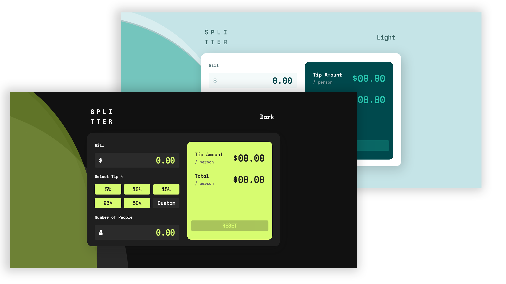

# SplitTer - Tip Calculator App 

This is a solution to the [Tip Calculator App](https://www.frontendmentor.io/challenges/tip-calculator-app-ugJNGbJUX).

## Table of contents

- [Overview](#overview)
  - [The challenge](#the-challenge)
  - [Screenshot](#screenshot)
  - [Links](#links)
- [My process](#my-process)
  - [Built with](#built-with)
  - [What I learned](#what-i-learned)
  - [Continued development](#continued-development)
- [Author](#author)
- [Acknowledgments](#acknowledgments)


## Overview

### The challenge

Users should be able to:

- View the optimal layout for the app depending on their device's screen size.
- See hover states for all interactive elements on the page.
- Calculate the correct tip and total cost of the bill per person.
- Additional Challenges: - 
   - Add the Dark Mode Theme Toggle(A LocalStorage One).
   - If Number of People is 0, then don't process further.
   - Add Animation and Hover to make it more user Attractive.
   - Add A Button Ripple Effect too.
   - Add a Animated Wave Background.

### Screenshot




### Links

- Solution URL: [https://github.com/SameerJS6/Tip-Calculator-App.git]
- Live Site URL: [https://tip-calculator-singh.netlify.app/]

## My process

- So, the First step was to analyze the task and divide it into sub-task.
- At first, I thought this will be easy as I had already built a Calculator but I was Wrong.
- Anyway, Started it up by setting up the custom properties for (Colors, Background, Dark Mode - Colors, Font-size, Font-weight, Transition, Font-Family, etc, And Some Utility Classes.)
- Once, the custom properties were done, started constructing the HTML layout and styling it.
- It took nearly 2-2.5 hours to finish the complete Responsive Design of the Calculator. Excluding the Dark Theme Mode Colors.
- Then, Started with the JavaScript Functionality and thought it will be easy, but it wasn't at all, and panicked at the Start.
- So, Finished the day by writing the Dark Mode Toggler(A LocalStorage One) and the Ripple Button Effect.
- Next Day, Started with the First step i.e dividing the Bigger tasks into Smaller ones and tackling them, so Wrote the Function for User Amount Input and Validate it and then one by one did every single Functionality.
- After all the basic functionality was done, then started with CSS One more time but this time with Animation and Hovers.
- Animated the whole Calculator and Added all the necessary hover effects in order to make it more interactive.
- Then, Started Finding the Colors for Dark Mode and Came up with this Material Design (Green) by Going with Material Design (Google) And Implementing it.
- Then, I thought that was it but felt like something is missing, so I remember that a few days ago I saw an animated wave background and it looked Pretty Cool.
- So, I decided to Implement it in this one, so I did and with that Added.
- The whole process of building this so-thought-easy project came to an end.
            -Thank You...!  (It Was Hard Trust Me)

### Built with

- SVG
- Flexbox
- Vanilla JS
- CSS Animation
- Semantic HTML5 markup
- CSS custom properties
- Mobile-first workflow

### What I learned

- Learned a Lot about, 
    - Picking up Colors.
    - Modern UI's Look and Feel.
    - logic building in javascript.
    - Advanced Animations and Hovers in CSS.
    - Javascript Functions and how to use them properly and also about writing clean and reusable code in javascript.

Also learned about this Function, see below:

```js
function Validate(j) {
  var RegExp = /^[0-9]/;  
  return j.match(RegExp); 
}
```

- The Above Function is a Global Search for Numbers that are not from 0 to 9.


### Continued development

- Obviously, learn more about JavaScript Functions and Logic Solving Problems.
- And last not but least, Focus will be on Writing a Clean, Reusable, and Readable Program. 
- Surely, Will Continue the journey to learn more about CSS Animation and How to make it more Interactive.


## Author

- GitHub - [Sameer Singh](https://github.com/SameerJS6/Tip-Calculator-App.git)
- Frontend Mentor - [@SameerJS6](https://www.frontendmentor.io/profile/SameerJS6)

## Acknowledgments

- Credits to 
  - Google
  - Youtube 
  - StackFlow
  - ColorSpace
  - Material Design
For helping me throughout this project.
